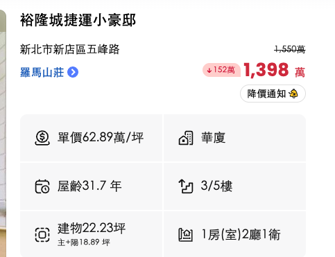
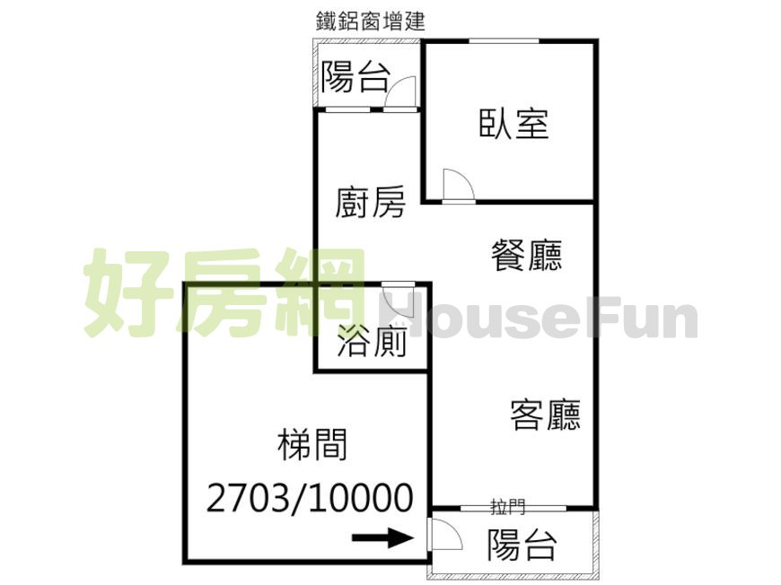

# 新店五峰路・羅馬山莊（裕隆城捷運小豪邸）

> 資料來源：房仲物件頁截圖、好房網平面圖、永慶房仲網照片（2026-10-06 整理）。
> 照片為廣角拍攝，空間看起來會比實際大；實際尺寸以坪數與平面圖為準，再用照片中的門、插座、地板條寬等標準物件校正。

## 物件資訊

| 項目 | 內容 |
| --- | --- |
| 地址 | 新北市新店區五峰路（羅馬山莊社區） |
| 總價 | **1,398 萬**（原開 1,550 萬，已降 152 萬） |
| 單價 | 62.89 萬／坪 |
| 型態 | 華廈 |
| 樓層 | 3 / 5 樓 |
| 屋齡 | 31.7 年（約 1995 年完工） |
| 建物坪數 | 22.23 坪（主建物＋陽台 18.89 坪） |
| 公設 | 約 3.34 坪，公設比約 15%（由上兩數推算） |
| 格局 | 1 房 2 廳 1 衛 |

## 平面圖

平面圖觀察（尚未實測，僅就圖面與照片判讀）：

- **入口在前陽台**：平面圖箭頭由梯間進入前陽台，照片 03 可看到陽台外側的大門。也就是說沒有室內玄關，進門後經陽台拉門進客廳。
- **長條形一字動線**：前陽台 → 客廳 → 餐廳 → 廚房 → 後陽台，公共空間連成一條，採光主要來自前陽台的落地拉門。
- **臥室在後側角落**，有一般窗加一扇高窗，房門開在餐廳旁。
- **浴廁在中間**，平面圖上沒有對外窗，靠排風扇換氣。
- **廚房開放**，與餐廳之間沒有隔間門。
- **後陽台為鐵鋁窗增建**（圖面標註），屬加蓋部分。
- 梯間標示「2703/10000」，推測是梯間的持分比例，需向房仲確認。

## 照片

| # | 檔案 | 空間 | 看到的重點 |
| --- | --- | --- | --- |
| 01 | [01-客廳-看向前陽台-1](photos/01-客廳-看向前陽台-1.png) | 客廳 | 落地拉門加上方氣窗、分離式冷氣、左牆有一扇高窗 |
| 02 | [02-客廳-看向前陽台-2](photos/02-客廳-看向前陽台-2.png) | 客廳 | 左側深色石紋磚主牆、天花板有梁、陽台外看得到綠意與高樓 |
| 03 | [03-客廳-電視牆與入口](photos/03-客廳-電視牆與入口.png) | 客廳 | 電視牆、弱電箱、陽台外側可見大門（入口在陽台） |
| 04 | [04-餐廳-看向廚房與臥室門](photos/04-餐廳-看向廚房與臥室門.png) | 餐廳 | 廚房開放無門、廚房牆面有外露的給排水管（疑似洗衣機位）、右為臥室門 |
| 05 | [05-廚房-流理台與爐具](photos/05-廚房-流理台與爐具.png) | 廚房 | 一字型流理台、雙口爐、排油煙機、玻璃烤漆壁面 |
| 06 | [06-廚房-看向後陽台](photos/06-廚房-看向後陽台.png) | 廚房 | 爐台旁有窗、冰箱在對面、盡頭為後陽台門 |
| 07 | [07-後陽台-鐵鋁窗增建](photos/07-後陽台-鐵鋁窗增建.png) | 後陽台 | 加蓋採光罩與格柵窗、窗外緊鄰邊坡擋土牆、熱水器在此 |
| 08 | [08-臥室-窗側](photos/08-臥室-窗側.png) | 臥室 | 一般窗加高窗、分離式冷氣、窗外為後側邊坡 |
| 09 | [09-臥室-衣櫃側](photos/09-臥室-衣櫃側.png) | 臥室 | 一整面推拉門衣櫃 |
| 10 | [10-浴廁](photos/10-浴廁.png) | 浴廁 | 有浴缸加淋浴拉門、立柱式面盆、百葉門 |

## 看屋時待確認

- 臥室與部分牆面下緣有斑駁痕跡（照片 08、09），需現場確認是否為壁癌或滲水。
- 後陽台與臥室窗外緊鄰邊坡擋土牆：採光、通風、濕氣與邊坡安全狀況。
- 後陽台增建的合法性與漏水狀況。
- 浴廁無窗的通風效果。
- 梯間持分比例與管理費。

## 價格評估（2026-10-06，推估）

- 開價 1,398 萬（62.89 萬/坪）。估合理成交 **1,150–1,250 萬**（約 52–56 萬/坪），建議首次出價約 1,100 萬，上限約 1,280 萬。
- 社區成交：2022/07 40.3 萬/坪、2022/02 33.8、2021/12 29.0、2021/11 31.8（成家網）；2019/04 同為 1 房 22.5 坪的 4 樓，含車位 655 萬（591）。
- 周邊：2026/08 新店區公所站附近屋齡 46–53 年無電梯公寓成交 46–50 萬/坪（信義）。
- 缺 2023 年後的社區成交紀錄，取得後需校正。

## 設計評估

- [退休宅評估（人生規劃角度）](評估-退休宅.md)
- [配置平面圖與 3D 示意](design/index.html)（線上版：https://claude.ai/artifact/93gTTxz69S79brFmzyXqpx）
